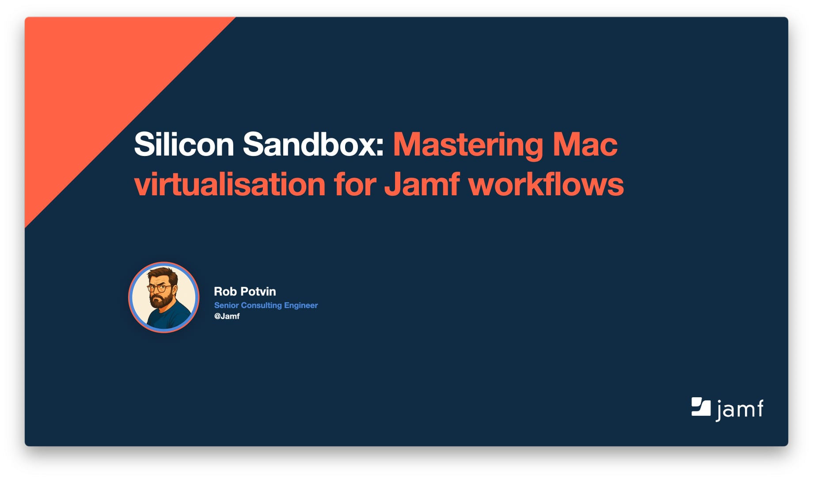

# Silicon Sandbox: Mastering Mac virtualisation for Jamf workflows - macad.uk2025

### [Read Blog Post](https://www.motionbug.com/the-cookbook-baking-up-your-perfect-jamf-pro-test-vm/)

---

Resources from my talk at macad.uk named **"Silicon Sandbox: Mastering Mac virtualisation for Jamf workflows"**.

In this repo is a packer templates, and resources for automating macOS virtualization for macadmins with Jamf Pro / School.

