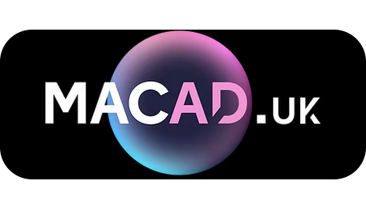
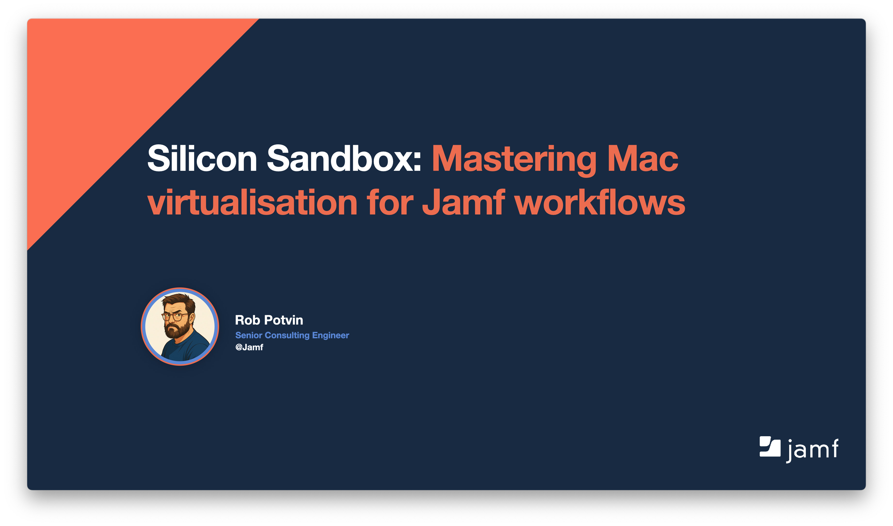

# Silicon Sandbox: Mastering Mac virtualisation for Jamf workflows - macad.uk2025

Resources from my talk at macad.uk named **"Silicon Sandbox: Mastering Mac virtualisation for Jamf workflows"**.

## Overview

A collection of scripts, templates, and resources for automating Mac virtualization and Jamf integration.

## Getting Started

1. Clone this repository.
2. See the `packer-templates/` directory for Packer configuration examples.

## Resources

- [Talk Slides](URL_TO_SLIDES)
- [Jamf Documentation](https://docs.jamf.com/)

## License

MIT